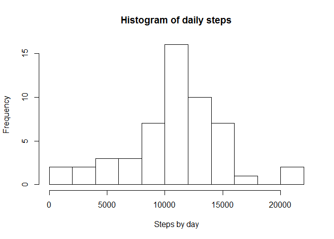
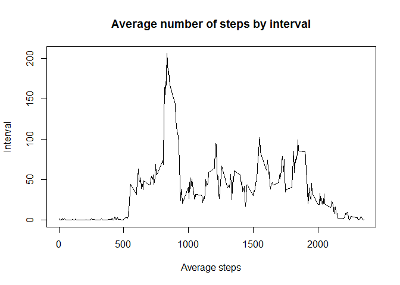
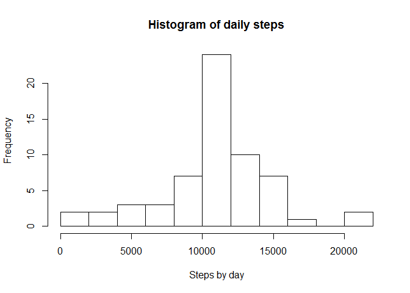
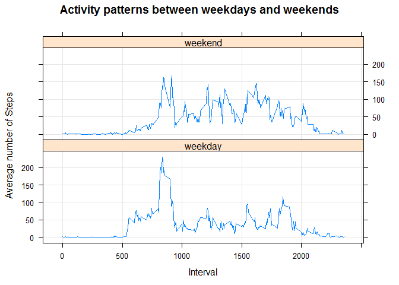

# Reproducible Research: Peer Assessment 1


## Loading and preprocessing the data
In this section we unzip the input data file and load it in a dataset.  
We convert the column date from character to date (POSIXct).  
And we show the data structure.

```r
unzip("activity.zip")
activity <- read.csv("activity.csv")
activity <- mutate(activity, date=ymd(activity$date))
str(activity)
```

```
## 'data.frame':	17568 obs. of  3 variables:
##  $ steps   : int  NA NA NA NA NA NA NA NA NA NA ...
##  $ date    : POSIXct, format: "2012-10-01" "2012-10-01" ...
##  $ interval: int  0 5 10 15 20 25 30 35 40 45 ...
```

## What is mean total number of steps taken per day?
First, we calculate the total number of steps taken by day (NA values are ignored).   
Then we make a histogram of the daily steps.  
Finally, we calculate the mean and the median of the total number of steps taken per day.

```r
stepsday <- activity %>%
        filter(is.na(steps)==FALSE) %>%
        group_by(date) %>%
        summarise(steps=sum(steps))

hist(stepsday$steps, xlab="Steps by day", main="Histogram of daily steps",
     breaks=10)
```

 

```r
meansbd <- as.integer(mean(stepsday$steps))
medsbd <- as.integer(median(stepsday$steps))
```
The mean and the median of the total number of steps taken per day are
respectively **10766** and **10765**.  

## What is the average daily activity pattern?
First, we calculate the average number of steps taken by interval (NA values are ignored).   
Then we make a time series plot of the 5-minute interval and the average number of steps taken, averaged across all days.  
Finally, we determine the interval from where the maximum number of steps have been taken.

```r
stepsinterval <- activity %>%
        filter(is.na(steps)==FALSE) %>%
        group_by(interval) %>%
        summarise(steps=mean(steps))

plot(stepsinterval$interval, stepsinterval$steps, type="l",
     xlab="Average steps",
     ylab="Interval",
     main="Average number of steps by interval")
```

 

```r
maxstepsinterval <- stepsinterval[which.max(stepsinterval$steps),"interval"]
```
The maximum number of steps taken in the day is in the interval **835**.

## Imputing missing values

The list of the missing values by column is:

```r
sapply(activity, function(x) sum(is.na(x)))
```

```
##    steps     date interval 
##     2304        0        0
```
Only the column steps has missing values.  
Missing values will be replace by the mean for that 5-minute interval across all the days in the dataset.  
Then we will run the same operations as in the first section and analyze the difference looking at the histogram and the mean and median values.

```r
activity2 <- merge(activity,stepsinterval, by="interval") %>%
                mutate(steps=ifelse(is.na(steps.x), steps.y, steps.x)) %>%
                select(steps,date,interval) %>%
                arrange(date,interval)

stepsday2 <- activity2 %>%
        group_by(date) %>%
        summarise(steps=sum(steps))

hist(stepsday2$steps, xlab="Steps by day", main="Histogram of daily steps",
     breaks=10)
```

 

```r
meansbd2 <- as.integer(round(mean(stepsday2$steps)))
medsbd2 <- as.integer(round(median(stepsday2$steps)))
```
The mean and the median of the total number of steps taken per day are
respectively **10766** and **10765**.

There is no difference of the total number of steps distribution nor in the mean and median total number of steps. This is completely normal as missing values where replaced by the mean for **that 5-minute interval** across all the days in the dataset.

## Are there differences in activity patterns between weekdays and weekends?
First, we add a variable (daytype) to the dataset to indicate weekdays and weekends.   
Then we calculate the mean number of steps taken by week period (weekdays or weekends) and by interval.  
Then we make a time series plot of the 5-minute interval and the average number of steps taken.

```r
activity2 <- mutate(activity2, daytype=factor(ifelse(wday(date) %in% c(1,7), "weekend", "weekday")))

stepsinterval2 <- activity2 %>%
        group_by(daytype, interval) %>%
        summarise(steps=mean(steps))

xyplot(steps~interval | daytype,
       data = stepsinterval2,
       type = 'l',
       xlab = "Interval",
       ylab = "Average number of Steps",
       main= "Activity patterns between weekdays and weekends",
       layout = c(1,2),
       panel = function(...) {
               panel.grid(h = -1, v = -1)
               panel.xyplot(...)
       })
```

 

There are some difference in the activity patterns between weekdays and weekends:  
1. weekdays activity starts earlier but ends earlier than weekends activity  
2. weekdays activity is more intense in the first part of the day (-> interval 1000) but less               intense in the second part of the day (-> interval 1700) than weekends activity
